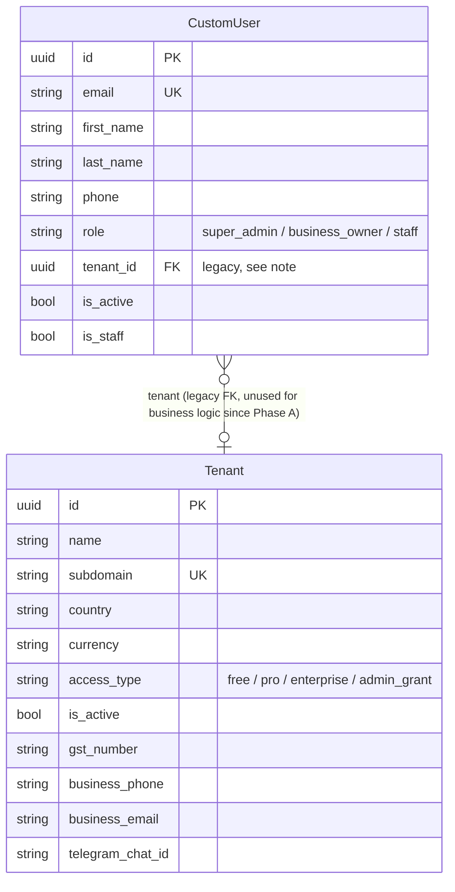
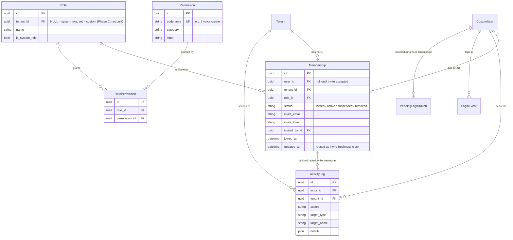
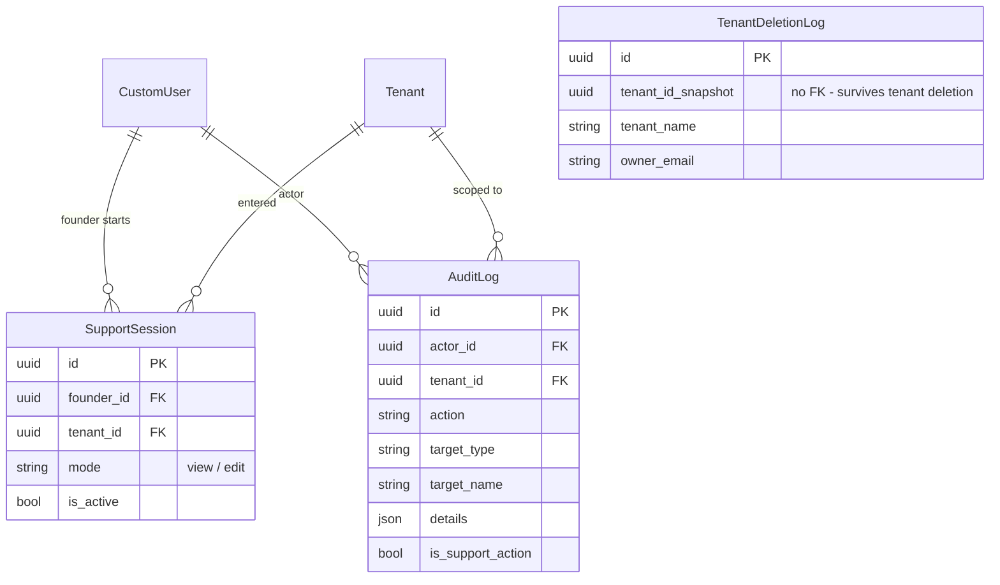
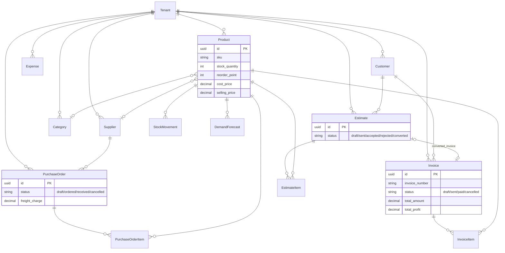
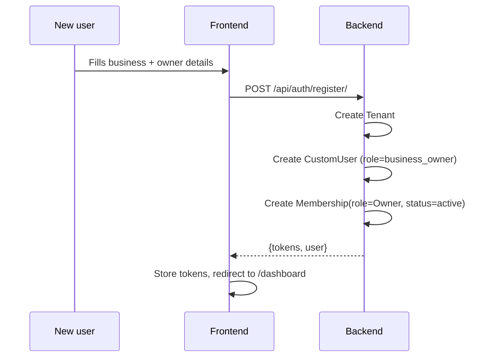
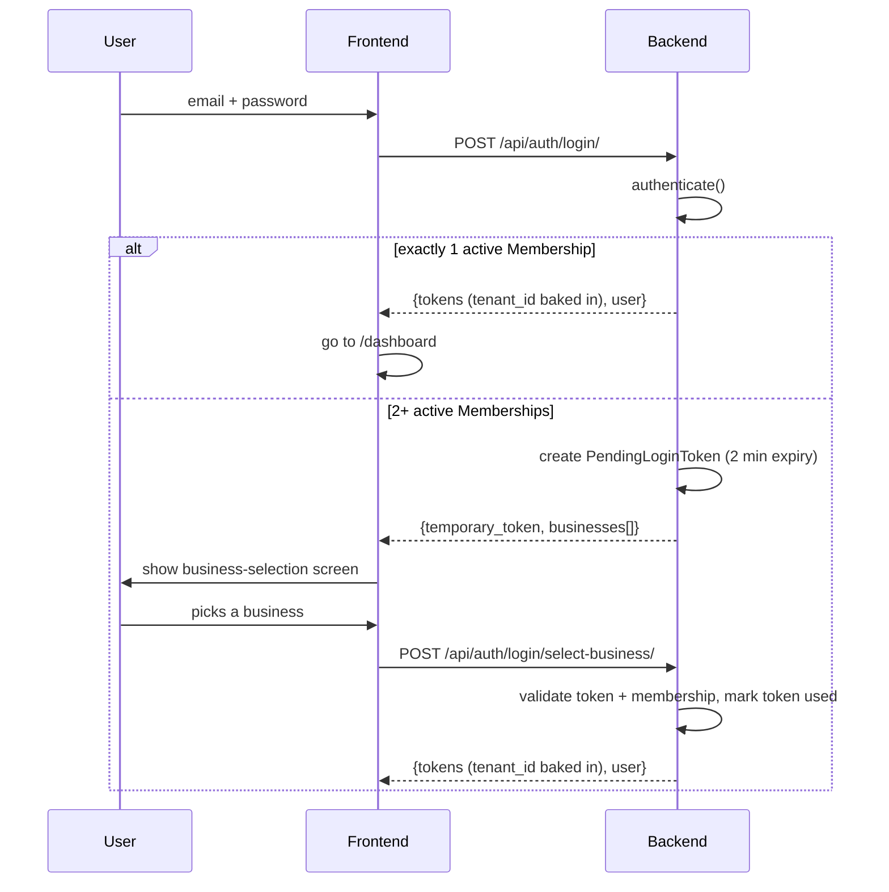
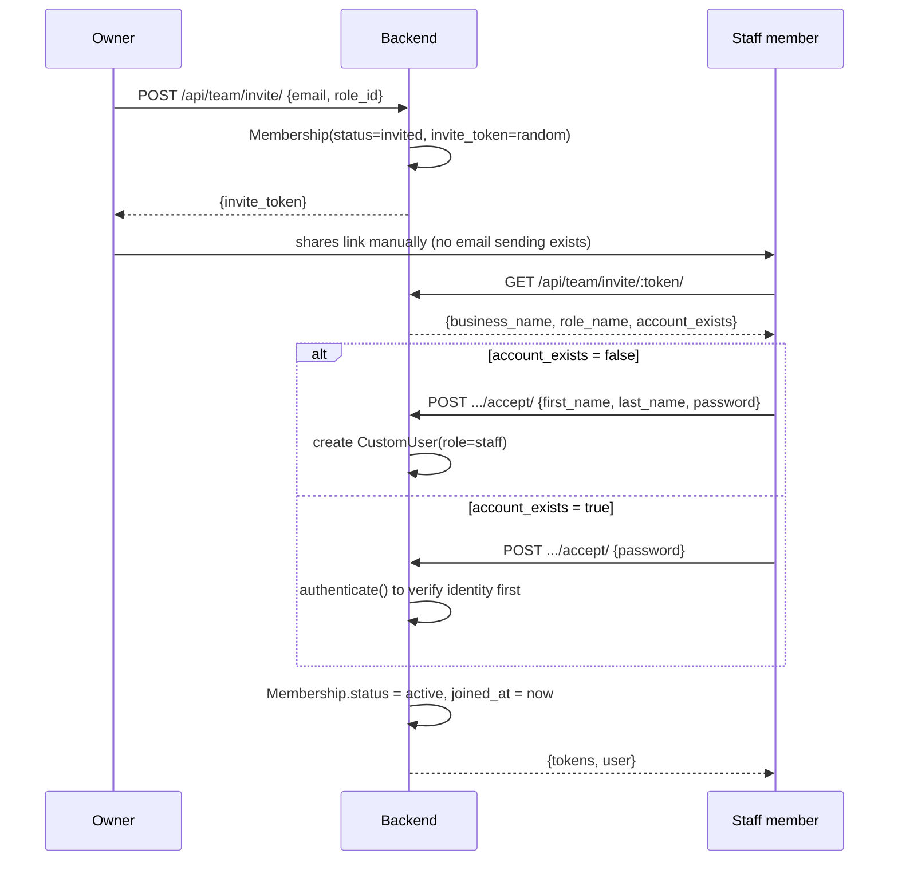
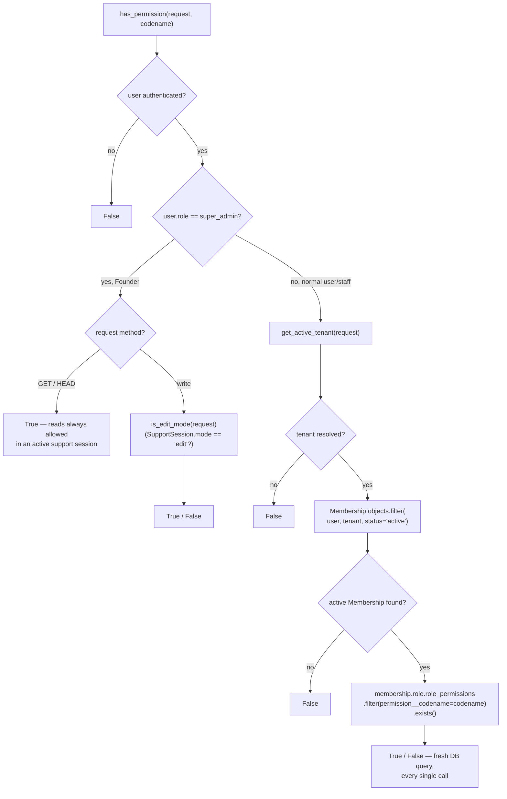
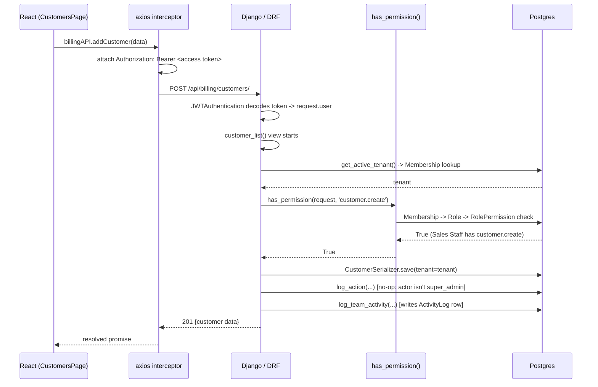

# BillingMars — Architecture

This document exists so a new contributor (or a future version of whoever's reading this) can understand how BillingMars is put together without re-reading every file. It covers the database schema, how authentication works, how permissions are enforced, and what happens end-to-end during a real request.

It reflects the codebase as of the completion of **Phase B (Team Management / RBAC)**.

---

## 1. Stack Overview

| Layer | Technology |
|---|---|
| Backend | Django 6.0.6 + Django REST Framework, JWT auth via `djangorestframework_simplejwt` |
| Database | PostgreSQL (Supabase) |
| Frontend | React 19 + Vite, Tailwind CSS, `react-router-dom`, `axios` |
| Backend hosting | Render (Free tier — single worker, no Celery/Redis) |
| Frontend hosting | Vercel |

Two completely separate user populations share this one codebase:

- **Tenants** — businesses using BillingMars (Owner + invited staff). Everything in this document about "Membership/Role/Permission" is about them.
- **The Founder** — the platform operator (`CustomUser.role == 'super_admin'`). The Founder has their own support-session mechanism and is deliberately **not** part of the Membership/Role system described below. This separation was a hard architectural requirement from day one — see [§7 Design Principles](#7-key-design-principles).

---

## 2. Database Schema

The schema is grouped into four clusters. Every model below was read directly from the current codebase — nothing here is inferred.

### 2.1 Identity & Tenancy



> **Note on `CustomUser.tenant`:** this field still exists for backward compatibility but is no longer the source of truth for "who belongs to which business." That job now belongs entirely to `Membership` (below). A single `CustomUser` can have **multiple** `Membership` rows — that's how one person can be staff at two different businesses.

### 2.2 Team & RBAC (built in Phase A/B)



**Key constraints worth knowing:**
- `Membership(user, tenant)` is unique — but only enforced when `user` is non-NULL, so multiple *pending* invites (`user=NULL`) to the same tenant don't collide with each other at the DB level (the invite endpoint handles that in application code instead — see §3.4).
- `Membership.save()` has a hard guard: it raises an exception if you ever try to attach a `super_admin` user to a Membership row. The Founder can never accidentally end up in this table.
- `Role(name)` is globally unique when `tenant IS NULL` (the 5 system roles: Owner, Manager, Sales Staff, Accountant, Viewer), and unique per-tenant when `tenant` is set (custom roles — schema exists, feature not built yet).

### 2.3 Founder / Support Mode (pre-existing, untouched by Phase A/B)



`AuditLog` and `ActivityLog` look similar on purpose — they were deliberately kept as **two separate models** (not one shared table) because they answer two different questions: "what did the Founder do while supporting a client?" vs. "what did this business's own staff do?" Mixing them was considered and rejected.

### 2.4 Business Data (Billing + Inventory)



Every one of these models carries a direct `tenant` foreign key — that's how tenant isolation works at the query level (every view filters `.filter(tenant=tenant)`, where `tenant` comes from `get_active_tenant()` — see §4).

---

## 3. Authentication Flow

There are four distinct ways a JWT ends up in someone's browser. All four converge on the same `get_tokens_for_user()` helper (`users/views.py`), which mints an access + refresh token pair and — critically — bakes a `tenant_id` **claim** into the access token when needed for disambiguation (never a permission or role, just a tenant pointer).

### 3.1 Registration → instant Owner account



### 3.2 Login — single business vs. multi-tenant staff



`PendingLoginToken` is a deliberately simple, opaque, single-use, 2-minute-expiry random string (`secrets.token_urlsafe(32)`) — **not** a JWT, so it can never accidentally be replayed against a real API endpoint. There's no Celery/cron to clean up expired rows (Render Free tier constraint) — `cleanup_expired()` just runs lazily at the top of both login endpoints.

### 3.3 Token refresh (silent, on every 401)

The frontend's `axios` interceptor (`services/api.js`) catches any `401`, calls `POST /api/auth/token/refresh/` once, retries the original request with the new access token, and only redirects to `/` if the refresh token itself is dead. `ROTATE_REFRESH_TOKENS=True` + `BLACKLIST_AFTER_ROTATION=True` mean every refresh issues a new refresh token and blacklists the old one.

### 3.4 Invite → Accept (staff onboarding, built in Phase B)



There is genuinely no email-sending infrastructure in this project — that was an explicit decision (see §7) rather than an oversight. The Owner copies a link and sends it however they want.

---

## 4. Permission Flow — `has_permission()`

This is the single function every tenant-facing view calls before doing anything. It lives in `teams/permissions.py`.



### The "Turant Effect Guarantee"

This is the core promise from the original plan, and it's why the flowchart above says "fresh DB query, every single call": **no permission or role is ever cached inside the JWT.** The access token only ever carries a `tenant_id` claim for disambiguating which business a multi-tenant staff member is currently in — nothing about *what they're allowed to do*.

Practical effect: if an Owner changes someone's role, or suspends them, from `Sales Staff` to `Manager` (or off the team entirely), the change takes effect on that person's **very next API call** — using the exact same access token they already had. No logout, no re-login, no waiting for token expiry. This was verified end-to-end (see the Phase B verification checkpoint): a Sales Staff member was promoted to Manager and successfully deleted an invoice one HTTP call later, using a token issued before the promotion.

### `get_active_tenant()` — the other half of the story

Every permission check depends on first knowing *which business* the request is even about. `superadmin/utils.py` resolves this differently depending on who's asking:

- **Normal user:** look at their active `Membership` rows. Exactly one → that's the tenant. Zero → no access. Two or more → disambiguate using the JWT's `tenant_id` claim, but only after confirming a matching Membership is *still* active right now (this is what makes suspension take effect instantly even mid-session).
- **Founder:** resolved entirely differently, through their active `SupportSession` — completely independent of the Membership system above.

---

## 5. Request Lifecycle (worked example)

Tracing one real request end to end: **a Sales Staff member creates a customer.**



Two logging calls fire at every one of these business-data mutation points, side by side, and exactly one of them ever actually writes a row:

- `log_action()` (`superadmin/audit.py`) — writes to `AuditLog`, but silently no-ops unless `request.user.role == 'super_admin'`.
- `log_team_activity()` (`teams/activity.py`) — writes to `ActivityLog`, but silently no-ops if the actor **is** `super_admin`.

This mirrored-pair pattern means Founder actions and staff actions can never end up in the wrong log, without an if/else branch cluttering every view.

---

## 6. The Permission Matrix (finalized, Phase B)

44 permissions across 6 categories, assigned to 5 system roles. Full source of truth: `teams/migrations/0002`, `0005`, `0006`, `0007`.

| Category | Owner | Manager | Sales Staff | Accountant | Viewer |
|---|:---:|:---:|:---:|:---:|:---:|
| Invoices (view/create/edit/delete/status) | ✅ all | ✅ all | view/create/edit/status (no delete) | view/status only | view only |
| Estimates | ✅ all | ✅ all | view/create/edit/status/convert (no delete) | — | view only |
| Customers | ✅ all | ✅ all | view/create/edit **basic fields only** | view only | view only |
| Products / Inventory | ✅ all | ✅ all | view only | — | view only |
| Categories / Suppliers | ✅ (`.manage`) | ✅ (`.manage`) | — | — | — |
| Purchase Orders | ✅ all | ✅ (no delete¹) | — | view only | view only |
| Expenses | ✅ all | ✅ all | — | ✅ all | view only |
| Reports (profit/health/forecast/cashflow) | ✅ all | ✅ all | — | ✅ (no forecast.generate) | view only |
| Business Settings | ✅ | — | — | — | view only |
| Team management | ✅ | view activity only | — | — | — |

¹ `purchase_order.delete` is granted to Manager per migration `0007`.

The **Sales Staff "basic fields only"** customer edit is enforced at the field level, not just the endpoint level: `customer_detail`'s PUT handler explicitly rejects `tax_number`/`country` in the request body with a 403 if the caller only has `customer.edit_basic` (not full `customer.edit`) — it doesn't silently strip the fields, so the user gets a clear error instead of a confusing silent no-op.

---

## 7. Key Design Principles

Decisions worth knowing before extending this system, so the same ground doesn't get re-litigated:

1. **Founder and tenant RBAC never touch.** The Founder uses `SupportSession`/`AuditLog`; tenants use `Membership`/`Role`/`Permission`/`ActivityLog`. A hard model-level guard (`Membership.save()`) makes it impossible for a `super_admin` user to ever get a Membership row, even via the Django admin or a shell.
2. **No permission is ever cached in a JWT.** Every check is a live DB query. This was a deliberate trade-off of a bit of query overhead for correctness — see §4.
3. **No email infrastructure.** Invite links are copy/share, not auto-emailed. Adding real transactional email (SMTP or a provider like Resend) is a real infra decision for later, not something to casually bolt on.
4. **No Celery/Redis/cron on Render's Free tier.** Anything that would normally be a background job (expired token cleanup, scheduled reports) is instead done lazily at the top of the relevant request handler.
5. **Soft deletes everywhere in business data.** Products, customers, categories, suppliers use `is_active=False`; team members use a `removed` status. Nothing destructive actually runs `DELETE FROM`.
6. **Permission gaps get a migration, not a workaround.** Three permissions (`estimate.delete`, `purchase_order.delete`, and the Business Settings pair) were discovered missing from the original 40-permission catalog while wiring enforcement into real views, and were added via dedicated, clearly-commented migrations rather than reusing an unrelated existing permission.
7. **Read access is often more permissive than write access**, by design, when the alternative would hide information a role can already infer some other way — e.g. Manager can view the team roster via `team.view_activity` even without `team.manage`, since they can already see staff names in the Activity Log.

---

## 8. Frontend Route Map

```
/                          Login (public)
/register                  New business signup (public)
/accept-invite/:token      Invite acceptance (public — no auth yet)

/dashboard, /products, /invoices, /estimates,
/profit-intelligence, /expenses, /forecasts,
/customers, /inventory, /purchase-orders,
/stock-history, /settings                       Regular business app (ProtectedRoute)
/team                      Team Management (ProtectedRoute)
/team/activity             Activity Log (ProtectedRoute)

/admin/*                   Founder Command Center (RoleRoute: super_admin only)
/admin/businesses/:id      Founder's Business Workspace (RoleRoute: super_admin only)
```

The Founder's `/admin/*` tree and the regular business app are two entirely separate React page trees with separate layouts (`AdminLayout` vs `Layout`). Team Management intentionally only exists in the regular business app's `Layout` — it was never added to the Founder's workspace sidebar, matching principle #1 above.

---

## 9. What's Not Built Yet

Two items from the original plan remain explicitly out of scope as of this document:

- **"View as Member"** (Phase B.5) — Owner impersonating a staff member's view, reusing the existing View/Edit Mode toggle concept.
- **Custom roles** (Phase C, Pro/Enterprise only) — the schema already supports it (`Role.tenant` is nullable specifically for this), but no UI or endpoints exist yet.
